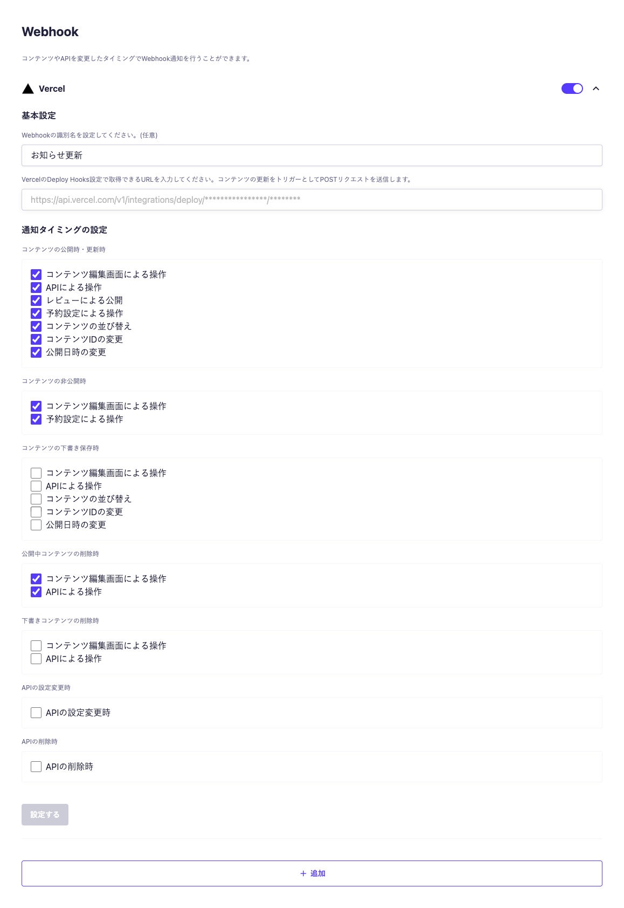

# JOYZO コーポレートサイト

株式会社ジョイゾーのコーポレートサイトです。  
フレームワークには Astro + Svelte を使用し、モダンで軽量な Web サイトになっています。

## サイト構成

```
トップページ（index）
├ ジョイゾーとは（aboutus）
├ 会社概要 (company)
├ 採用情報 (recruit)
├ プライバシーポリシー(privacy)
├ ニュース (news)
└ お問い合わせ (contact)
```

## 動作環境

- Node.js 18 以上
- Astro 5.x
- Svelte 5.x

## 環境変数の設定

ルート直下に`.env`ファイルを作成し、下記の情報を入力してください。

```
PUBLIC_MICROCMS_API_KEY=xxxxxxxxxx
PUBLIC_MICROCMS_SERVICE_DOMAIN=xxxxxxxxxx
PUBLIC_SITE_URL=xxxxxxxxxx
PUBLIC_FORM_URL=xxxxxxxxxx
PUBLIC_GOOGLE_ANALYTICS_ID=xxxxxxxxxx
```

### 環境変数の詳細

`PUBLIC_MICROCMS_API_KEY`  
microCMS 管理画面の「サービス設定 > API キー」から確認できます。  
API キーの権限は GET のみに設定してください。

`PUBLIC_MICROCMS_SERVICE_DOMAIN`  
microCMS 管理画面の URL（https://xxxxxxxx.microcms.io）の xxxxxxxx の部分です。

`PUBLIC_SITE_URL`  
デプロイ先の URL です。プロトコルから記載してください。  
例） https://xxxxxxxx.vercel.app/ など

`PUBLIC_FORM_URL`  
お問い合わせの送信先です。form タグの action に指定されます。

`PUBLIC_GOOGLE_ANALYTICS_ID`  
GA4 を使った GoogleAnalytics の測定 ID です。

## 開発の仕方

### 1. パッケージのインストール

```bash
npm install
```

### 2. 開発環境の起動

```bash
npm run dev
```

### 3. 開発環境へのアクセス

[http://localhost:3000](http://localhost:3000) にアクセス

### 4. ビルドテスト

```bash
npm run build
```

## 技術スタック

- **フレームワーク**: Astro 5.x
- **UI フレームワーク**: Svelte 5.x
- **スタイリング**: Tailwind CSS
- **CMS**: microCMS
- **デプロイ**: Vercel

## 主要コンポーネント

### トップページ（新デザイン）
- `NewHeroSection.svelte` - ヒーローセクション（マニフェストコピーのループ表示）
- `VisionSection.svelte` - 会社ビジョンセクション
- `ManifestoSection.svelte` - マニフェスト一覧セクション（カードUI、モバイルスワイプ対応）
- `PartnersSection.svelte` - 実績・パートナーセクション
- `RecruitSection.svelte` - 採用セクション（SNSリンク付き）
- `StoryMediaSection.svelte` - ストーリー・メディアセクション（note、SNS、ダウンロード）
- `ContactSection.svelte` - お問い合わせセクション（フォームブリッジ連携）

### 既存コンポーネント
- `HeroAnimation.svelte` - 旧トップページのヒーローアニメーション
- `ScrollStorySection.svelte` - スクロールストーリーセクション
- `CoreCopySection.svelte` - コアコピーセクション
- `AboutSection.svelte` - ジョイゾーとはセクション
- `CompanySection.svelte` - 会社概要セクション
- `CareersSection.svelte` - 採用情報セクション

## デプロイについて

### 新しいデプロイシステム

このプロジェクトでは、GitHub ActionsとローカルCLIの両方でデプロイを管理する新しいシステムを採用しています。

#### デプロイフロー
- **開発環境 (Vercel)**: `develop`ブランチへのpush → Vercel自動デプロイ
- **本番環境 (EC2)**: `main`ブランチへのpush/merge → GitHub Actionsで自動デプロイ
- **ローカルデプロイ**: コマンドラインから任意の環境にデプロイ可能

#### 主な特徴
- **リリースディレクトリ方式**: 瞬時の切り替えと簡単なロールバック
- **自動デプロイ**: GitHub Actionsによる完全自動化
- **ローカルバックアップ**: 緊急時のローカルデプロイ対応
- **将来対応**: EC2テストサーバーへの切り替えを想定した設計

### 自動デプロイ（推奨）

#### 開発環境へのデプロイ
```bash
git checkout develop
git add .
git commit -m "Update: 変更内容の説明"
git push origin develop
```

#### 本番環境へのデプロイ
```bash
git checkout main
git merge develop  # または直接mainにpush
git push origin main
```

### ローカルデプロイ

#### 本番環境へのデプロイ
```bash
# ビルド + デプロイ
npm run build
npm run deploy:production

# または一括実行
npm run deploy -- --env production
```

#### 開発環境へのデプロイ
```bash
# ビルド + デプロイ
npm run build
npm run deploy:development

# または一括実行
npm run deploy -- --env development
```

#### ロールバック
```bash
# 利用可能なリリース一覧表示
npm run rollback -- --env production --list

# 直前のバージョンにロールバック
npm run rollback -- --env production

# 指定バージョンにロールバック
npm run rollback -- --env production --version 20251024120000
```

### 初期設定

#### 1. GitHub Secretsの設定
GitHub リポジトリの **Settings > Secrets and variables > Actions** で以下のSecretsを設定：

**EC2本番環境用:**
- `EC2_HOST`: EC2サーバーのIPアドレス
- `EC2_USER`: SSHユーザー名
- `EC2_SSH_KEY`: SSH秘密鍵

**Vercel開発環境用:**
- `VERCEL_TOKEN`: Vercel認証トークン
- `VERCEL_ORG_ID`: VercelオーガニゼーションID
- `VERCEL_PROJECT_ID`: VercelプロジェクトID

#### 2. ローカル環境の設定
```bash
# 環境変数ファイルを作成
cp env.local.example .env.local

# .env.localを編集して実際の値を設定
nano .env.local
```

#### 3. EC2サーバーの初期設定
```bash
# デプロイスクリプトをサーバーにアップロード
scp scripts/setup-ec2-deploy.sh user@your-server:/tmp/

# サーバーに接続して初期設定を実行
ssh user@your-server
sudo bash /tmp/setup-ec2-deploy.sh
```

### 下位互換性

既存のデプロイコマンドは引き続き使用可能です：

```bash
# 旧デプロイコマンド（引き続き使用可能）
npm run deploy:production:legacy
npm run deploy:images
npm run deploy:no-images
npm run deploy:specific
```

詳細な手順については `DEPLOYMENT.md` を参照してください。

### webhook の設定

microCMS のコンテンツ更新があったタイミングで Vercel のデプロイをフックしましょう。
https://document.microcms.io/manual/webhook-setting#h065a574f0d

通知タイミングの設定は以下を参考にしてください。


「お知らせ」の API で同様に設定します。

## 画面プレビューの設定

このテンプレートでは「お知らせ」の microCMS API が使用されています。  
画面プレビューが利用可能です。  
microCMS の管理画面から URL の設定をする必要があります。  
https://document.microcms.io/manual/screen-preview

以下に画面プレビューの設定例を示しますのでドメイン部分を実際にデプロイする先に合わせて変更ください。

- お知らせ
  https://ドメイン/news/preview?contentId={CONTENT_ID}&draftKey={DRAFT_KEY}

## ライセンス

このプロジェクトは株式会社ジョイゾーの所有物です。
